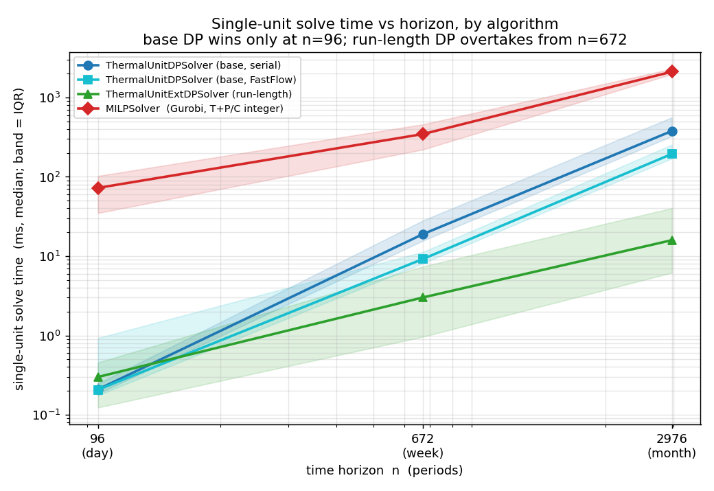
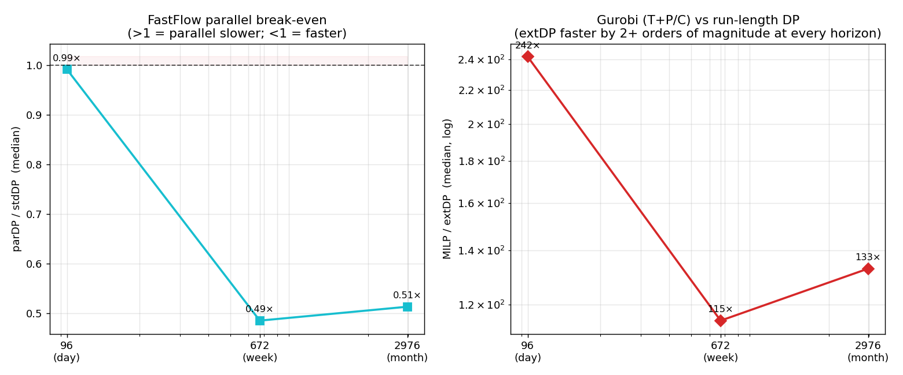

# Lagrangian-iteration timing study

How does the **single-unit** solve time behave along the iterations of a
Lagrangian dual, and how do the two exact dynamic-programming solvers compare
with a general-purpose MILP solver on the *same* integer problem?

The study lives entirely under this directory so the base `ucblock_solver`
never carries the experimental per-iteration dump (see `makefile`): a normal
build leaves the `SAVE_TUB` macro at `0`.

## Pipeline

1. **`ucblock_solver` built with `-DSAVE_TUB=1`** solves a single-bus `UCBlock`
   with a `LagrangianDualSolver` and, every `intEverykIt` Lagrangian iterations
   (the standard inner-`BundleSolver` parameter in `../config/LDCfg.txt`),
   serializes each inner `ThermalUnitBlock` — carrying its *current Lagrangian
   costs* — to `TUB-<unit>-<iter>.nc4`.
2. **`timing_harness <dir>`** times four solvers on each dump and prints
   `unit,iter,solver,time_us` (median of a few reps):
   - `stdDP` — `ThermalUnitDPSolver`, serial (the base $O(n^3)$ scheme);
   - `parDP` — `ThermalUnitDPSolver`, FastFlow parallel (`intMaxThread 0`);
   - `extDP` — `ThermalUnitExtDPSolver` (the run-length variant);
   - `MILP`  — a `:MILPSolver` on the **T + Perspective-Cuts** formulation
     (`../config/TUBCfg-tpc.txt`, `wf = 9`), solved as an integer MILP
     (`intRelaxIntVars 0`) so it is the same problem the exact DPs solve. The
     back-end is chosen in `../config/TUBSCfg-MILP.txt` (currently Gurobi).
3. **`plot_lagrangian_timing.py`** produces, per horizon, the time vs normalized
   Lagrangian iteration (mean ±1σ band, per generator type), the per-unit
   normalized "does it vary along the iteration?" plot, and the by-type boxplot.

All four solve the *same* integer single-unit problem; the iteration index is
normalized to `[0,1]` per instance before pooling (instances run a different
number of LD iterations).

## Running

Build the two experiment binaries (recompiles `../ucblock_solver.cpp` with
`SAVE_TUB`, in place):

    make                 # serial-threshold default
    make PARMIN=0        # force the FastFlow parallel DP on every horizon

Then run the driver. The full ~10⁴-iteration LD solve is the wall-clock
bottleneck (≈0.78 iter/s at `n=96`, ≈0.045 at `n=672`), while the per-unit solve
time is flat along the iteration, so a handful of dump waves suffices; the
`LD_MAXITER` knob caps the LD (using a per-run copy of the config, the shared
`../config/LDCfg.txt` is untouched):

    LD_MAXITER=700 HORIZONS="day week" SEEDS="1 2 3 4 5" \
      PYTHON=/usr/bin/python3.14 ./run-lagrangian-timing

See the header of `run-lagrangian-timing` for every knob (`OUT`, `REPS`,
`MILP_REPS`, `LDTIMING_CONFIG`, …) and the exact reproducible recipe, including
running the binaries from a copy outside a synced folder.

## Findings

The single-unit solve time is **flat along the Lagrangian iteration**
(≈1.5–3% on every horizon and solver) and is governed by the unit *type*
(≈13× spread, peakers vs base-load). The median time per solve scales very
differently with the horizon `n` (`day` 96 / `week` 672 / `month` 2976):

|        |   day  |  week  |  month  | scaling                       |
|--------|-------:|-------:|--------:|-------------------------------|
| stdDP  |  209µs | 19.0ms |  378ms  | superlinear ($O(n^3)$)        |
| parDP  |  207µs |  9.2ms |  194ms  | FastFlow over the base scheme |
| extDP  |  300µs |  3.0ms | 15.9ms  | near-linear (run-length)      |
| MILP   |   72ms |  346ms |   2.1s  | T+P/C integer, Gurobi         |

(median single-unit solve time, 50 units per horizon.)

The same data, viewed by solution algorithm (`plot_algorithms.py`):

- **The base DP wins only at short horizons.** At `n=96` `stdDP` (209µs) beats
  the run-length `extDP` (300µs); from `n=672` up `extDP` overtakes it (3.0ms vs
  19.0ms) and the gap widens to ≈24× at `n=2976`, as the `O(n^3)` vs near-linear
  complexity predicts.
- **The parallel break-even is between `n=96` and `n=672`.** With the FastFlow
  path forced on every horizon (`PARMIN=0`), `parDP` matches serial `stdDP` at
  `n=96` — the thread-dispatch overhead is not amortised by a ≈0.2ms solve, and
  inflates the mean above the median — but is ≈**2× faster** from `n=672` up.
  This is why `ThermalUnitDPSolver` takes the parallel path only above a
  compiled-in horizon threshold (`TUDPS_PAR_MIN_N`, default 768).
- **The MILP cost is per-solve overhead, not branch-and-bound.** A single `n=96`
  T+P/C integer solve is a linear MILP (1285 rows, 672 columns, 288 binaries)
  found optimal **at the root, in one node**, with ≈77% of the time in model
  build and **presolve** (≈0.1s, growing to ≈2s at `n=2976` on a 41k-row model).
  The cost is data-dependent: at a near-zero Lagrangian cost presolve collapses
  the model (≈0.7ms), but at any non-trivial dual it cannot reduce it and the
  full cost is paid at every solve. A Lagrangian dual solves the single-unit
  problem on the order of `10⁴` times, so Gurobi pays this fixed build-and-presolve
  cost each time regardless of the trivial optimization, whereas the dedicated DP
  rebuilds and solves in sub-millisecond time — the run-length DP is two-plus
  orders of magnitude faster at every horizon.
